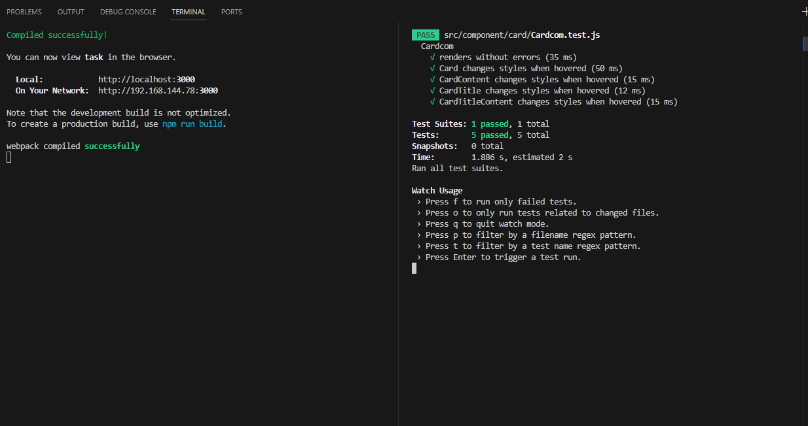

<h1 align="center"> 🚀 This is a "Animated Line and Card Expansion" Component. 🚀</h1><br/>

&nbsp;&nbsp;Discriptin:
This is an interactive "Animated Line and Card Expansion" component to enhance the user experience
on our website. The component will feature animated lines and an expanding hover state for information
cards.<br/>
&nbsp;&nbsp;This is produced by using React 18 and MUI, ensure compliance with ADA standards for accessibility, including screen reader support and keyboard navigation and implement the design responsively, with distinct behaviors for desktop, tablet, and mobile as specified

### 1. Scroll Animation
    - As the user scrolls down the page, the lines on the section titled "Insurance" will animate.<br/>
    - The animation consists of redrawing the light grey lines with a darker line, starting from the center line under "Insurance".<br/>
    - The lines will progressively get darker upon scrolling, transitioning from Mid-Grey to BG Steel
### 2. Card Expasion
    - The card's size increases, specifically in height, which is observable by the increased padding compared to other cards.
    - The arrow icon within the card will shift to the right by 8px.
    - The background color of the card will transition from BG Grey to Parchment
### 3. Mobile Responsive
    - The "Active Insurance" title is not displayed.
    - All lines within the section are removed.
    - The "Insurance" and "Security Services" categories are presented with their respective cardsstacked vertically

### 4.Testing method

#### `npm start`

    Runs the app in the development mode.\
    Open [http://localhost:3000](http://localhost:3000) to view it in your browser.

    The page will reload when you make changes.\    
    You may also see any lint errors in the console.
#### `npm test`

    Start Jset testing

#### About cypress testing 

    On the internet, download cypress.zip.
    Open cypress.exe, then select the project folder.
    Select testing mode to E2E testing.
    Choose spec files to run.

    You can see the testing result.

## <a href="https://uploadcare.com/blog/intersection-observer-guide/">Intersection Observer API(link)</a>

&nbsp;&nbsp;The Intersection Observer API lets code register a callback function that is executed whenever a particular element enters or exits an intersection with another element (or the viewport), or when the intersection between two elements changes by a specified amount.

### &nbsp;&nbsp;&nbsp;&nbsp;&nbsp;&nbsp;- Creating an intersection observer

    Create the intersection observer by calling its constructor and passing it a callback function to be run whenever a threshold is crossed in one direction or the other:

```js
let options = {
  root: document.querySelector("#scrollArea"),
  rootMargin: "0px",
  threshold: 1.0,
};

let observer = new IntersectionObserver(callback, options);
```
###  &nbsp;&nbsp;&nbsp;&nbsp;&nbsp;&nbsp;- Intersection observer options

    The options object passed into the IntersectionObserver() constructor let you control the circumstances under which the observer's callback is invoked. It has the following fields:
```js
new IntersectionObserver(callback)
new IntersectionObserver(callback, options)
let observer = new IntersectionObserver(myObserverCallback, { threshold: 0.1 });
```
###  &nbsp;&nbsp;&nbsp;&nbsp;&nbsp;&nbsp;- Targeting an element to be observed

```js
let target = document.querySelector("#listItem");
observer.observe(target);
```
    Whenever the target meets a threshold specified for the IntersectionObserver, the callback is invoked. The callback receives a list of IntersectionObserverEntry objects and the observer:

```js
let callback = (entries, observer) => {
  entries.forEach((entry) => {
    // Each entry describes an intersection change for one observed
    // target element:
    //   entry.boundingClientRect
    //   entry.intersectionRatio
    //   entry.intersectionRect
    //   entry.isIntersecting
    //   entry.rootBounds
    //   entry.target
    //   entry.time
  });
};
```

## Component Object model
```js
{
 "id": "animated-line-card-expansion",
 "title": "Active Insurance",
 "sections": [
            {
                "id": "insurance",
                "title": "Insurance",
                "cards": [
                        {
                            "id": "active-cyber-insurance",
                            "title": "Active Cyber Insurance",
                            "body": "Manage and transfer cyber risk with broad coverage..."
                        },
                        {
                            "id": "active-tech-eo",
                            "title": "Active Tech E&O",
                            "body": "Comprehensive and innovative errors and omissions coverage..."   
                        }     
            // More cards...
                        ]
            },
            {
                "id": "security-services",
                "title": "Security & Services",
                "cards": [
            // Cards for Security & Services...
                        ]
            }
            ]
}
```

# cacache [](https://npm.im/cacache) [](https://npm.im/cacache) [](https://travis-ci.org/zkat/cacache) [](https://ci.appveyor.com/project/zkat/cacache) [](https://coveralls.io/github/zkat/cacache?branch=latest)

## Video of the project
<video src="PC.mp4" controls title="Title"></video>

## Video of testing method
<video src="cypress.mp4" controls title="Title"></video>

## Jest test result

